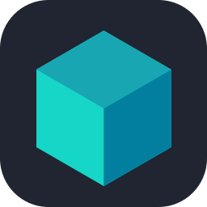

 

 

 

  

  

  

 

I'm a **Backend Developer** focused on building high-performance, fault-tolerant, and maintainable backend systems with **Go** and **Java / Spring Boot**.

My engineering foundation revolves around mission-critical backend principles: **concurrency models, API architecture, relational database indexing, distributed caching, asynchronous event streaming, and cloud-native containerization**.

* **Go Engineering:** Goroutines & Channels, Worker Pools, Context propagation, low-latency HTTP services.
* **Enterprise Java & Spring Boot:** Hexagonal / Clean Architecture, Spring Security, RESTful microservices, Hibernate tuning.
* **Database & Performance:** PostgreSQL schema optimization, ACID transactions, B-Tree indexes, Redis cache-aside patterns.
* **Event-Driven Architecture:** Kafka / RabbitMQ message brokers, pub-sub workflows, decoupling distributed workloads.
* **Testing & Quality Assurance:** Unit testing (JUnit 5, table-driven Go tests), Docker-based integration testing, JaCoCo code coverage metrics.
* **Reliability & Observability:** Structured logging, Prometheus metrics, Grafana dashboards, Docker containerization.

 

> *"Clean code always looks like it was written by someone who cares."* — Robert C. Martin (Uncle Bob)

  

  

 

### Programming Languages

  
  
  
  
  
  

### Backend & Frameworks

  
  
  
  
  
  

### Frontend & Data Formats

  
  
  
  
  
  

### Databases & Caching

  
  
  
  

### Security & Database Tooling

  
  
  

### Messaging & Asynchronous Processing

  
  

### Testing & Code Quality

  
  
  
  

### DevOps, Observability & Tooling

  
  
  
  
  
  
  
  
  
  
  
  
  
  
  
  
  

  

 

<table width="100%">
  <tr>
    <td width="33.3%" align="center">
      
    </td>
    <td width="33.3%" align="center">
      
    </td>
    <td width="33.3%" align="center">
      
    </td>
  </tr>
  <tr>
    <td width="33.3%" align="center">
      
    </td>
    <td width="33.3%" align="center">
      
    </td>
    <td width="33.3%" align="center">
      
    </td>
  </tr>
</table>

 

  

I am building toward a career as a **Software Architect** by strengthening my
experience in backend engineering, distributed systems, and system design. My
focus is on translating business requirements into practical technical solutions
that balance **scalability, reliability, security, maintainability, and cost**.

  

<table width="100%">
  <tr>
    <td width="33.3%" align="center">
      
       Understand the problem before designing the system.
    </td>
    <td width="33.3%" align="center">
      
       Make technical decisions with context and clarity.
    </td>
    <td width="33.3%" align="center">
      
       Turn designs into maintainable software that lasts.
    </td>
  </tr>
</table>

  

  

  

 

<table width="100%">
  <tr>
    <td width="50%" align="center">
      
    </td>
    <td width="50%" align="center">
      
    </td>
  </tr>
</table>

  

  

  

  

 

<picture>
  <source
    media="(prefers-color-scheme: dark)"
    srcset="https://raw.githubusercontent.com/PikayHuynh/PikayHuynh/output/github-contribution-grid-snake-dark.svg"
  />
  <source
    media="(prefers-color-scheme: light)"
    srcset="https://raw.githubusercontent.com/PikayHuynh/PikayHuynh/output/github-contribution-grid-snake.svg"
  />
  
</picture>

  

 

&nbsp;

&nbsp;

&nbsp;

&nbsp;

&nbsp;

### Let's Connect & Build Scalable Systems

  Always open to backend engineering discussions, architectural brainstorming, or open-source collaborations.

  
  &nbsp;
  
  &nbsp;
  

  

  Designed & Developed by <b>Huỳnh Minh Phương (PikayHuynh)</b>
   
  <i>"Write clean, build scalable, deliver reliable."</i>
    
  <a href="#top"><b>▲ Back to Top</b></a>

